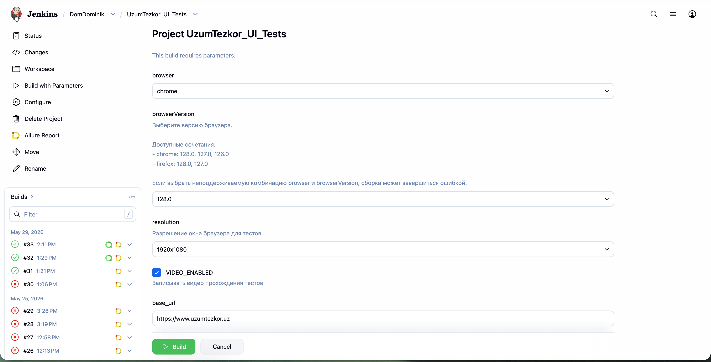
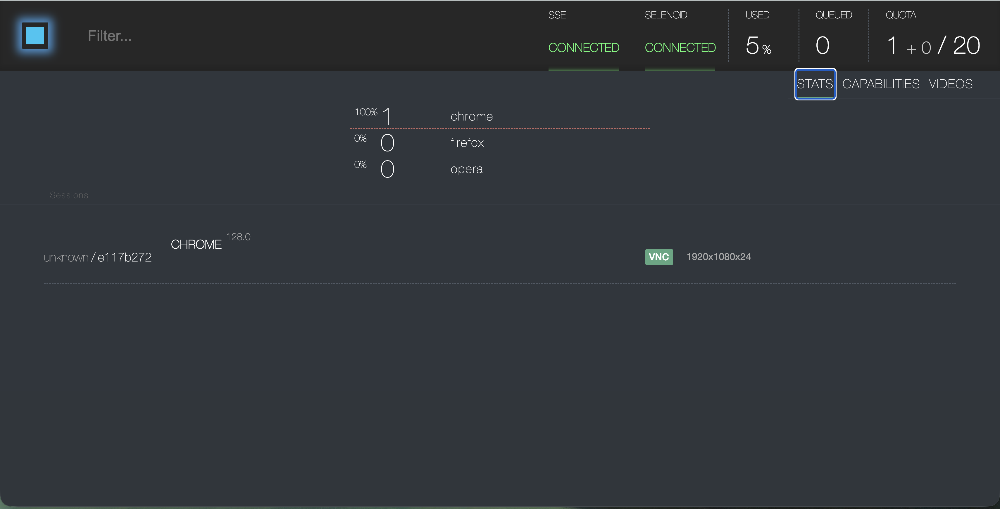
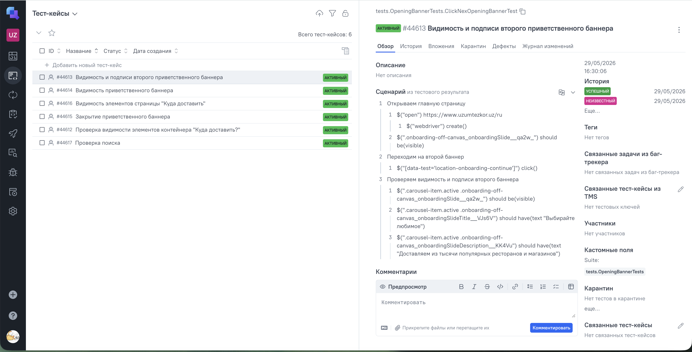
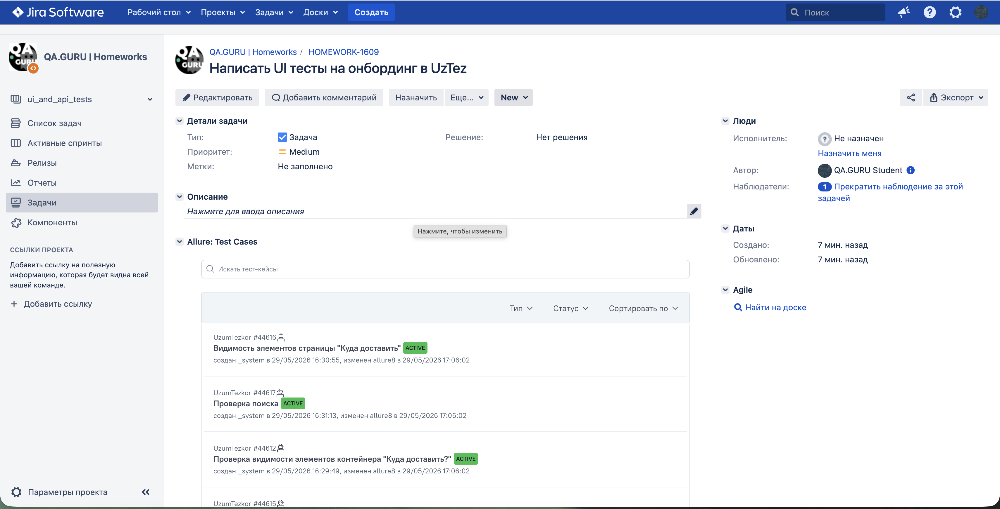
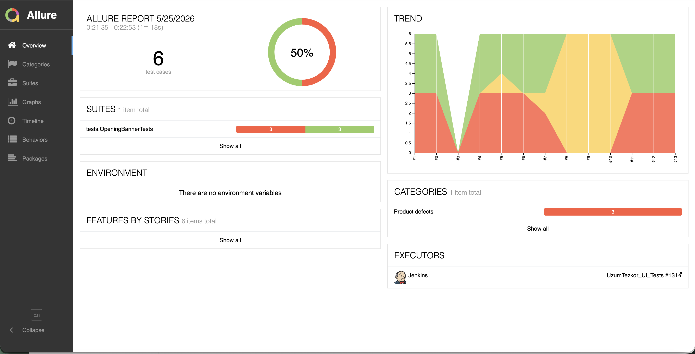
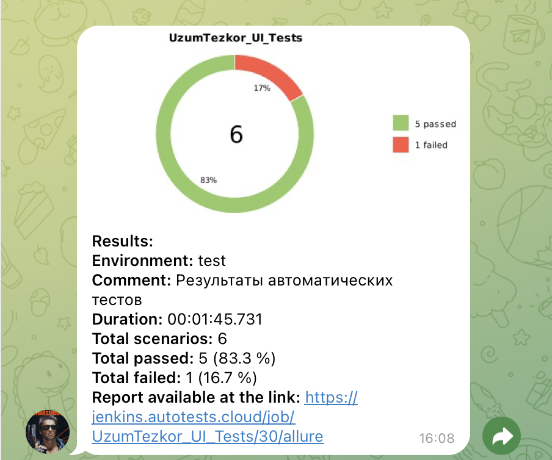

# Проект по автоматизации тестирования [UzumTezkor](#https://www.uzumtezkor.uz/ru)

> Проект включает в себя UI-автотесты для онбординга на сайте с использованием современного стека технологий и глубокой интеграции в CI/CD процессы.

## 🔗 Ссылки на проект и инфраструктуру
* [Тестируемый сайт](https://www.uzumtezkor.uz/ru)
* [Сборка в Jenkins](https://jenkins.autotests.cloud/view/DomDominik/job/UzumTezkor_UI_Tests/)
* [Отчет в Allure Report](https://jenkins.autotests.cloud/view/DomDominik/job/UzumTezkor_UI_Tests/33/allure/)
* [Проект в Allure TestOps](https://allure.autotests.cloud/project/5226/test-cases?treeId=0)
* [Задача в Jira](https://jira.autotests.cloud/browse/HOMEWORK-1609)

## 🛠 Технологический стек

<p align="center">
  <a href="https://www.jetbrains.com/idea/">
    
  </a>
  <a href="https://www.java.com/">
    
  </a>
  <a href="https://selenide.org/">
    
  </a>
  <a href="https://aerokube.com/selenoid/">
    
  </a>
  <a href="https://qameta.io/">
    
  </a>
  <a href="https://junit.org/junit5/">
    
  </a>
  <a href="https://gradle.org/">
    
  </a>
  <a href="https://github.com/">
    
  </a>
  <a href="https://www.jenkins.io/">
    
  </a>
  <a href="https://telegram.org/">
    
  </a>
  <a href="https://www.atlassian.com/software/jira">
    
  </a>
</p>


* **Язык**: Java 21
* **Фреймворки**: Selenide, JUnit 5
* **Сборка**: Gradle 8.x
* **Отчетность**: Allure Report, Allure TestOps
* **Инфраструктура**: Jenkins, Selenoid (Docker)
* **Уведомления**: Telegram Bot
---

## 🏗 Инфраструктура проекта

### 1. Jenkins CI/CD
Настроен Pipeline для сборки проекта и прогона тестов по тегам.
<p align="center">
  
</p>

### 2. Selenoid (Удаленный запуск браузеров)
Тесты запускаются в изолированных Docker-контейнерах. Selenoid позволяет наблюдать за выполнением теста в реальном времени.
<p align="center">
  
</p>

---

## 📊 Мониторинг и отчетность

### 1. Allure TestOps
Централизованная система управления тестированием. Здесь хранятся все тест-кейсы и история запусков.
<p align="center">
  
  
  
</p>

### 2. Интеграция с Jira
Результаты прогонов отображаются непосредственно в тикетах Jira, обеспечивая прозрачность для всей команды.
<p align="center">
  
</p>

### 3. Allure Report
Подробные отчеты с шагами выполнения, скриншотами и исходным кодом страницы в случае падения.
<p align="center">
  
</p>

---

## 🔔 Уведомления в Telegram
После каждой сборки бот присылает краткий отчет со статистикой прохождения тестов.
<p align="center">
  
</p>

---

### 🎥 Видео выполнения тестов
Использование Selenoid позволяет не только наблюдать за тестами в реальном времени, но и автоматически записывать видео каждого прогона. Это значительно ускоряет анализ причин падения тестов.

<p align="center">
  <video src="https://github.com/user-attachments/assets/af18a3ad-ffee-41bf-a2cc-743ef529b980" width="800" controls muted>
  </video>
</p>

---

## 🚀 Запуск проекта
### Локальный запуск
```bash
gradle clean test
